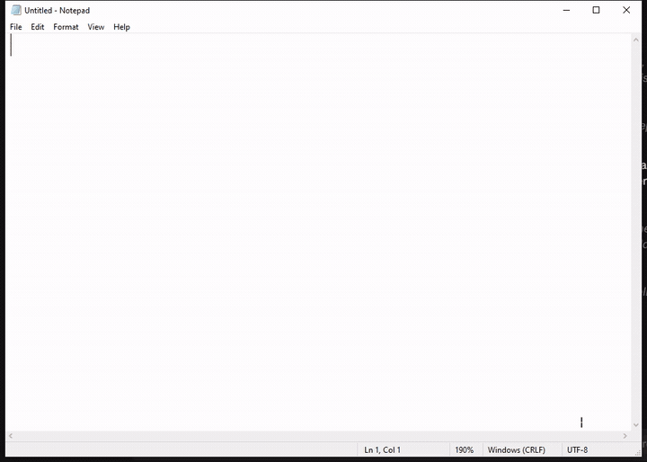

# texAi

Select text anywhere on Windows, press a hotkey, and a local Ollama model
rewrites it in place. Grammar, translation, rewording, tone.



There is a tray icon and a dashboard, but no window sits in your way: the
normal case is that you highlight something, press two keys, and the text
changes.

Want to install and use it rather than build it? See the
[user guide](USER_GUIDE.md).

## Why

Every cloud rewriting tool means sending whatever you highlighted to
someone else's server. texAi talks to `127.0.0.1:11434` and nothing else.
It works offline, and the text you select never leaves the machine.

The one file it writes is `%AppData%\texAi\settings.json`, which holds your
model, tone and hotkeys. Your rewrites are kept in memory for the session
so the dashboard can show them, and are gone when you quit.

## Hotkeys

| Hotkey       | Action               |
|--------------|----------------------|
| Ctrl+Alt+G   | Fix grammar          |
| Ctrl+Alt+T   | Translate to English |
| Ctrl+Alt+R   | Rewrite              |
| Ctrl+Alt+F   | Change tone          |

All four are rebindable in the dashboard.

They used to be Ctrl+Shift. That was a mistake: a global hotkey outranks
whatever app is focused, so Ctrl+Shift+T took "reopen closed tab" away from
every browser on the machine, Ctrl+Shift+R took hard reload, and
Ctrl+Shift+F took find-in-files in VS Code.

## Install

You need [Ollama](https://ollama.com/download) running locally, and a model:

```powershell
ollama pull qwen2.5:7b
```

Then run the installer from
[Releases](https://github.com/cthboss001/texai/releases), or build it
yourself below. The installer is per-user, so there is no UAC prompt.

texAi does not install Ollama for you. If Ollama is missing or the model
is not pulled, the dashboard says so and links to the download.

## Build

```powershell
dotnet build -c Release
```

To produce the folder the installer wraps:

```powershell
dotnet publish -c Release -r win-x64 --self-contained true -o publish
```

It is around 160 MB because it carries the whole .NET desktop runtime.
The installer's LZMA2 compresses that to roughly 50 MB.

Deliberately not `-p:PublishSingleFile=true`. A single-file WPF build leaves
its native `_cor3` DLLs loose beside the exe unless
`IncludeNativeLibrariesForSelfExtract` is also set, and 2.0.2 shipped exactly
that way: see below.

Run the installer from Explorer or an ordinary terminal. A terminal inside a
packaged (MSIX) app, such as the Claude desktop app, sees a virtualised
AppData: the install lands in that app's private copy, and the real
`%LocalAppData%\texAi` that the Startup shortcut runs is left as it was.

## When it would not open

2.0.2 did not open at all. It was published single-file, and a single-file WPF
build only bundles managed code: WPF's five native `_cor3` DLLs stay beside the
exe unless `IncludeNativeLibrariesForSelfExtract` is set. The installer copied
only `texAi.exe`, so every launch died with `DllNotFoundException` inside WPF's
first window procedure, 16 times in the event log between 21 and 23 September
2026. An exception there ends the process with no dialog, so it looked as if
nothing had happened.

2.0.3 fixed the packaging by shipping the whole publish folder. 2.0.4 also
loads those DLLs itself before WPF starts (`WpfNativeLibraries.cs`), so if one
is ever missing again you get a message naming it instead of silence.

Clicking texAi while it is already running now opens the dashboard. Before,
that second launch exited silently, which looked the same as a crash.

## How it works

```text
Global hotkey
  -> wait for you to let go of the chord
  -> save your clipboard
  -> Ctrl+C (synthetic, via SendInput)
  -> read the selection from the clipboard
  -> POST /api/generate to Ollama
  -> Ctrl+V the result back over the selection
  -> restore your clipboard
```

That first step matters more than it looks. A global hotkey fires on
key-down, so when texAi runs you are still physically holding the chord.
Injecting Ctrl+C on top of a held Shift makes the target app see
Ctrl+Shift+C, which in Firefox and Chrome opens the DevTools element
picker and copies nothing. texAi polls `GetAsyncKeyState` until the
modifiers are released, then forces key-ups if you are still holding after
400ms, and proceeds either way.

One transformation runs at a time; a hotkey pressed while one is in flight
is ignored. Every failure path leaves your selected text exactly as it was.

## Which model

The default is `qwen2.5:7b`. Three were tested on an RTX 2060 6GB against
romanised Bangla, Bangla script, grammar and tone.

| Model            | On disk | Loaded | CPU share | Typical rewrite |
|------------------|---------|--------|-----------|-----------------|
| qwen2.5:7b       | 4.4 GB  | 5.1 GB | 18%       | 0.4 to 0.9s     |
| aya-expanse:8b   | 4.7 GB  | 6.6 GB | 36%       | 0.8 to 1.9s     |
| gemma2:9b        | 5.1 GB  | 7.1 GB | 46%       | 1.8 to 3.2s     |

`aya-expanse` was the expected winner on Bangla and was not. It answers
"I have completed this project yesterday", which is a present perfect
against a past time marker, and it reads "কালকের মিটিং" as "the meeting
with the clock".

`gemma2:9b` is the only one that translates "ami valo hoye jabo" correctly
("I will be well"), and it matches qwen everywhere else. It costs about
three times the latency for it. If you write a lot of romanised Bangla,
switch to it in the dashboard; otherwise the default is faster and just as
accurate.

None of the three handles romanised Bangla reliably. "tumi kothay acho?
ami ekhon bashay" means "where are you? I'm at home now", and no model
tested gets the second half.

## When it does not work

Failures used to be one red dot. Now the dashboard's Errors section says
which of these it was: nothing selected, the app you are in stopped
responding, the clipboard is locked, Ollama is not running, the model is
not installed, the request timed out, or the model returned nothing.

texAi sends `keep_alive: 30m` on every request and preloads the model at
startup. Ollama unloads an idle model after about five minutes, and
reloading it plus the one-time CUDA warmup could outlast the 60 second
timeout, which is why it used to fail after a break.

## Files

`settings.json` in `%AppData%\texAi` is the only thing written to disk.
Delete it to go back to defaults. It is plain JSON and safe to hand-edit.
