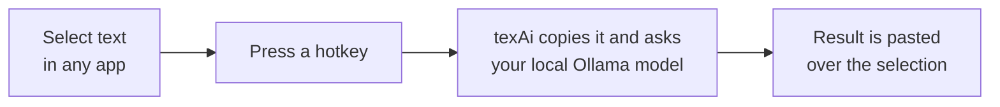
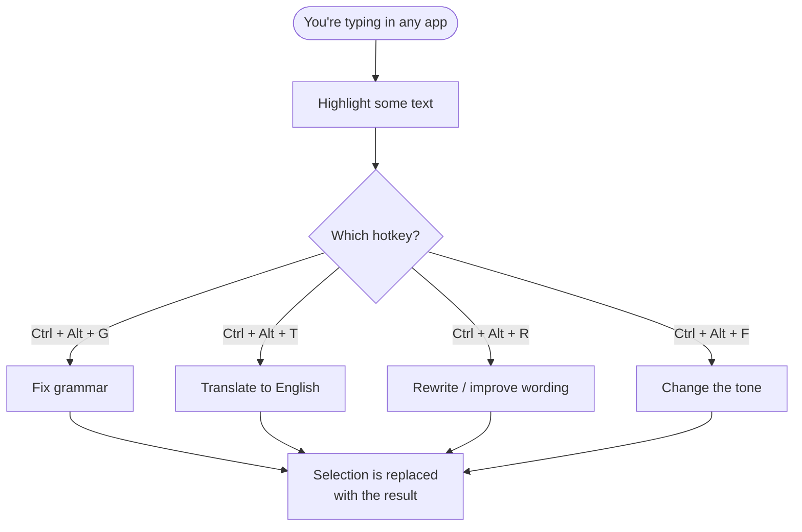
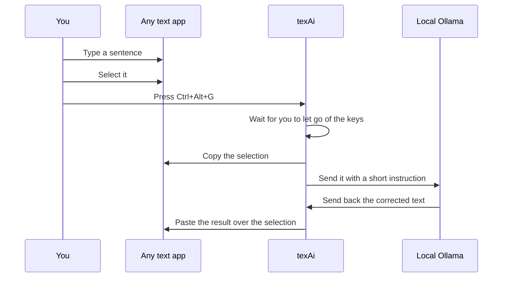
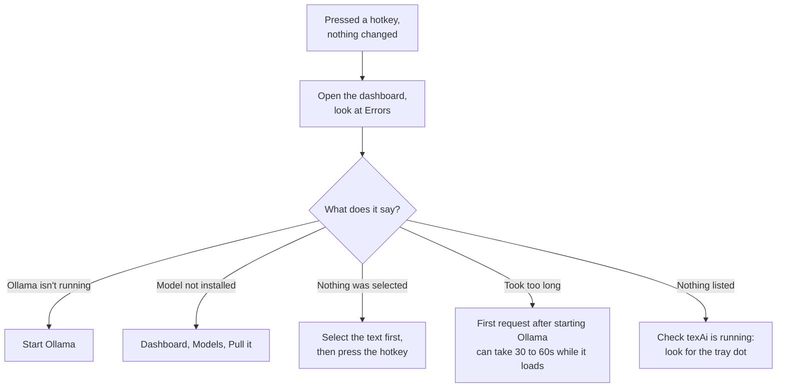

# texAi user guide

Select text anywhere on Windows, press a hotkey, get it rewritten in place.

## The whole idea, in one picture



Nothing is sent anywhere except your own computer. No cloud, no account.

## Step 1: install Ollama

texAi needs a local model server called Ollama to do the rewriting. It does
not install it for you, and it never downloads anything without you asking.

1. Go to [ollama.com/download](https://ollama.com/download) and get the
   Windows installer.
2. Run it. Ollama installs itself and runs in the background with no window.

## Step 2: get a model

Open PowerShell and run:

```powershell
ollama pull qwen2.5:7b
```

That is a one-time 4.7 GB download. You can also do this from texAi's
dashboard once it is installed, under Models, which shows a progress bar
and lets you cancel.

## Step 3: install texAi

Download the installer from the
[Releases page](https://github.com/cthboss001/texai/releases) and run it.
It installs for your user only, so Windows will not ask for administrator
rights. You can tick "start with Windows" during setup.

The first time it runs, the dashboard opens so you can see the state of
things. After that texAi stays out of the way: a small dot in the system
tray, green when Ollama is reachable and red when it is not.

## Step 4: use it



### The four hotkeys

| Press          | What happens                | Example in                            | Example out                                          |
|----------------|-----------------------------|---------------------------------------|------------------------------------------------------|
| `Ctrl + Alt + G` | Fixes grammar and spelling  | `i has completed this project yesterday` | `I completed this project yesterday.`             |
| `Ctrl + Alt + T` | Translates to English       | `আমি আগামীকাল অফিসে যাব`                | `I will go to the office tomorrow.`                |
| `Ctrl + Alt + R` | Rewrites for clarity        | `the meeting was very much productive`   | `The meeting was very productive.`                |
| `Ctrl + Alt + F` | Changes the tone            | `hey can u send me that file asap`       | `Could you please send me the file as soon as possible?` |

It works the same in Notepad, Chrome, Word, VS Code, Slack and email:
anywhere you can select text and press Ctrl+C.

A small green circle appears next to your cursor while it thinks, turns
into a checkmark when it is done, and shakes red if something went wrong.

### What it looks like in practice



That "wait for you to let go" step is real, and it is why the hotkeys are
Ctrl+Alt rather than Ctrl+Shift. If texAi copied while you were still
holding Shift, the app you are in would receive Ctrl+Shift+C instead of
Ctrl+C, which in Firefox and Chrome opens the developer tools.

## The dashboard

Double-click the tray icon, or right-click it and choose Open dashboard.

**Activity** shows what you rewrote this session, newest first, with the
latest rewrite and latest grammar fix pulled out at the top. It is cleared
when you quit texAi. This is deliberate: your text is never written to disk.

**Errors** shows what failed and why. If a hotkey seemed to do nothing,
this is where the reason is.

**Models** lists what you have installed with their size and quantisation,
lets you pull new ones with a progress bar, delete ones you do not want,
and compare several models on the same sample text side by side.

Anything over 5.5 GB is flagged. On a 6 GB graphics card the model's
working memory gets allocated on top of the weights, so a model that big
spills onto the CPU and a two second rewrite becomes thirty.

**Settings** is the active model, the tone used by the tone hotkey, and the
four hotkeys. To change a hotkey, click it and press the chord you want.

## If nothing happens



texAi fails quietly on purpose. If anything goes wrong your text is left
exactly as it was; it is never deleted or replaced with an empty result.

## Stopping it

Right-click the tray icon and choose Exit texAi.

## Privacy

texAi contacts `127.0.0.1:11434` and nothing else, ever. The text you
select goes to your own Ollama, is held in memory so the dashboard can show
it, and is gone when you quit.

The only file texAi writes is `%AppData%\texAi\settings.json`, which holds
your model, tone and hotkeys. It contains no text you have rewritten. You
can open it, edit it, or delete it to start fresh.
