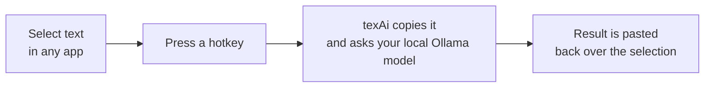
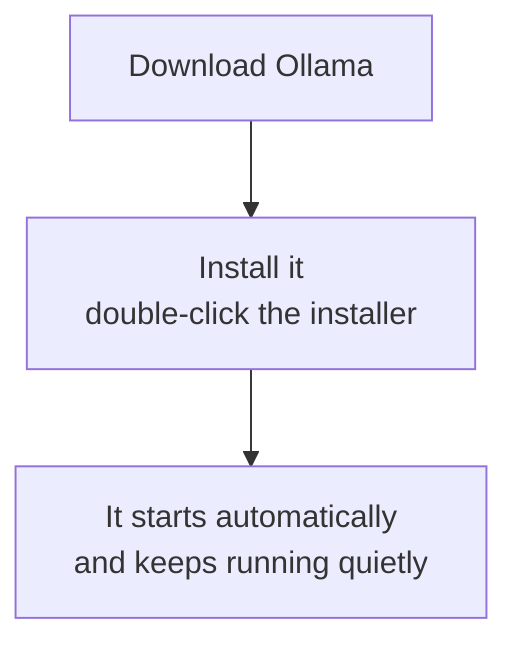
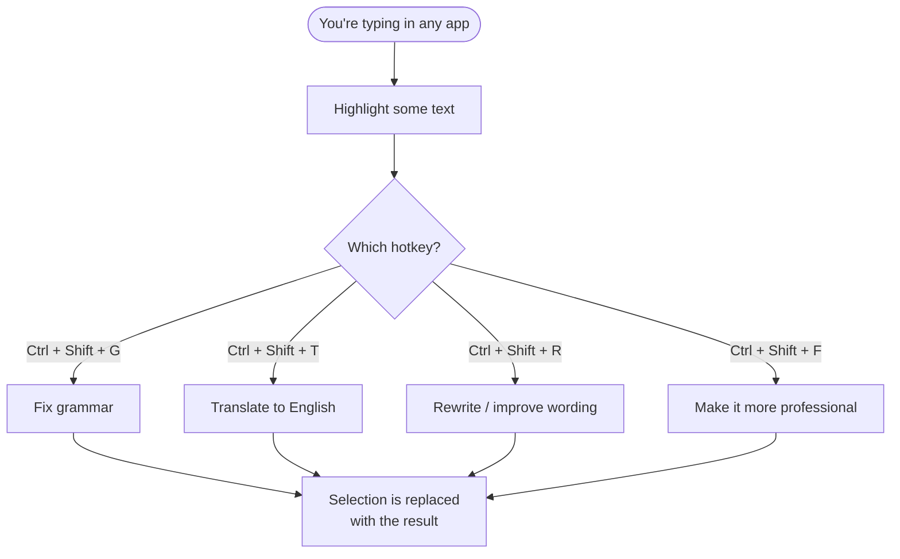
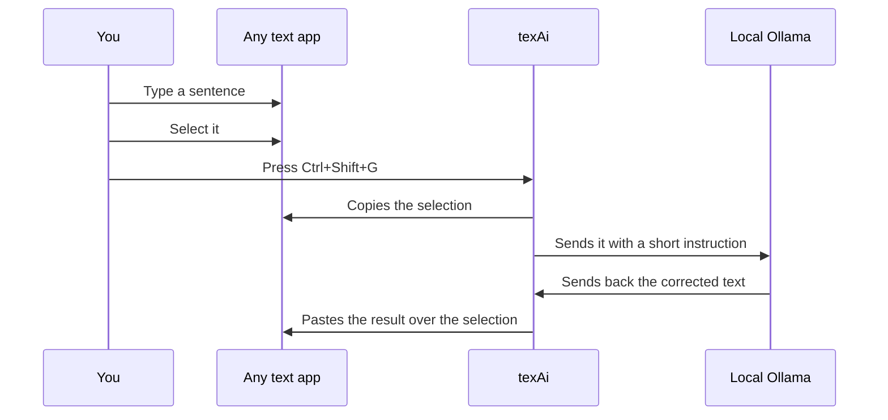
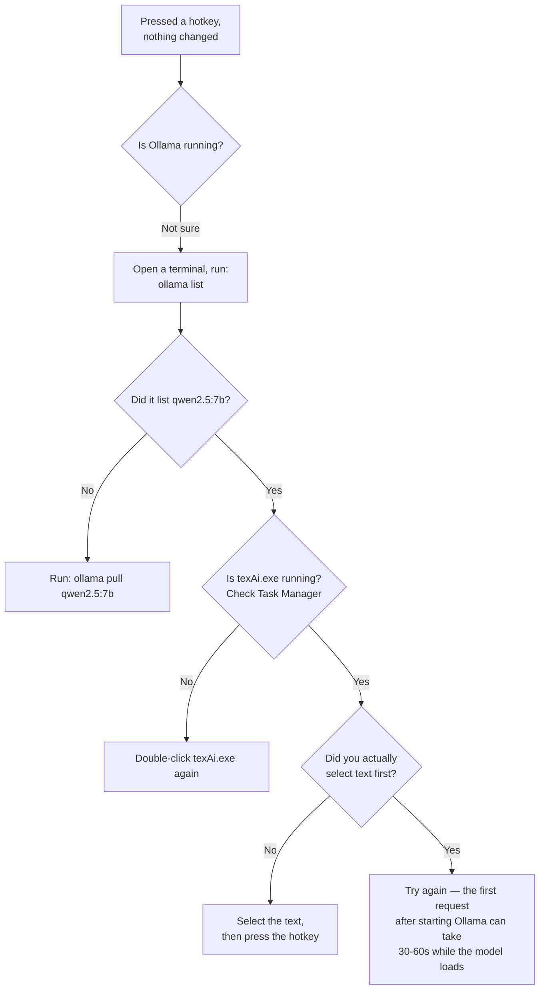

# texAi — user guide

Select text anywhere on Windows, press a hotkey, get it rewritten in place. No app window ever opens.

## The whole idea, in one picture



Nothing is sent anywhere except your own computer. There is no cloud, no account, no popup.

## Step 1 — Install Ollama

texAi needs a local model server called Ollama to actually do the rewriting.



1. Go to [ollama.com/download](https://ollama.com/download) and download the Windows installer.
2. Run it. Ollama installs itself and starts running in the background — you won't see a window.

## Step 2 — Get the model

Open a terminal (PowerShell or Command Prompt) and run:

```powershell
ollama pull qwen2.5:7b
```

This downloads the language model itself (about 4.7 GB), one time only. Wait for it to finish.

## Step 3 — Get texAi

1. Go to the [Releases page](../../releases) of this repo.
2. Download `texAi.exe` from the latest release.
3. Put it anywhere you like, for example `Documents\texAi\texAi.exe`.

No installer, no setup wizard. It's a single file.

## Step 4 — Run it

Double-click `texAi.exe`.

Nothing will appear on screen. That's expected — texAi has no window by design. It's now sitting quietly in the background, listening for hotkeys.

> To check it's actually running: open Task Manager → Details tab → look for `texAi.exe`.

## Step 5 — Use it



### The four hotkeys

| Press | What happens | Example in | Example out |
|---|---|---|---|
| `Ctrl + Shift + G` | Fixes grammar and spelling | `i has completed this project yesterday` | `I completed this project yesterday.` |
| `Ctrl + Shift + T` | Translates to English | `আমি আগামীকাল অফিসে যাব` | `I will go to the office tomorrow.` |
| `Ctrl + Shift + R` | Rewrites for clarity and flow | `the meeting was very much productive` | `The meeting was very productive.` |
| `Ctrl + Shift + F` | Makes the tone professional | `hey can u send me that file asap` | `Could you please send me the file as soon as possible?` |

It works the same way in Notepad, Chrome, Word, VS Code, Slack, email — anywhere you can select text and use Ctrl+C.

### What it looks like in practice



## If nothing happens



texAi fails silently on purpose: if Ollama isn't running, the model is missing, or the request times out, your text is left exactly as it was. Nothing is ever deleted or replaced with garbage or an empty result.

## Stopping it

texAi has no exit menu on purpose. To stop it: Task Manager → Details tab → find `texAi.exe` → End task.

## Changing the model or tone

Both are constants in the source, not settings screens — see [Config.cs](Config.cs) if you're building from source. Default model is `qwen2.5:7b`, default tone is `Professional`.

## Privacy

texAi never writes your text to disk, never logs it, and never contacts anything except `127.0.0.1:11434` — your own machine. See [README.md](README.md) for the technical details.
